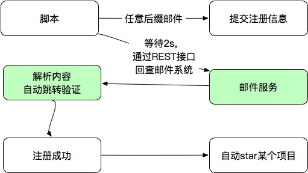

邮件接收这块给自动化？自动化涉及两个点：
1）要有无穷无尽的邮箱供你使用
2）要非常容易的获得邮件内容进行解析

稍作思考，一个方案就在脑海中浮现，竟然是超简单的存在。


其中：
1） 阉割的邮件系统不需要登录，只管收，不管发
2）邮件系统可以接受带有某后缀的任意邮件
3）提供简单的REST接口返回邮件JSON供解析

下面我们直接进入正题，说一下实现方式。

# 域名解析配置
打开域名管理，以阿里云为例，加入两条信息

加入一条A记录，指向我们将要部署的服务IP地址
```
A	mx	 6x.216.2xx.1xx
```

加入一条MX记录，指向上面配置的收邮件的域名地址。
```
MX	*	mx.sayhiai.com
```

> 注意 `*`号，意思是所有的域名包括二级域名等，都会被收到。比如xxxx@sayhiai.com 、 xjksfdsf@dfjsdlfjsd.sayhiai.com。
> 是不是无穷无尽？

# 编写SMTPD服务器

使用python可以很容易的实现一个SMTPD服务器，具体的是使用`aiosmtpd`库。邮件默认收到后是BASE64编码，还分很多部分和类型，解析起来还是比较麻烦的。需要猜解其编码并递归拼接邮件等。代码片段如下：
```python
def decode_str(s):
    value, charset = decode_header(s)[0]
    if charset:
        value = value.decode(charset)
    return value
def guess_charset(msg):
    charset = msg.get_charset()
    if charset is None:
        content_type = msg.get('Content-Type', '').lower()
        pos = content_type.find('charset=')
        if pos >= 0:
            charset = content_type[pos + 8:].strip()
    return charset
def print_part(msg):
    rs = ""
    content_type = msg.get_content_type()
    if content_type == 'text/plain' or content_type == 'text/html':
        content = msg.get_payload(decode=True)
        charset = guess_charset(msg)
        if charset:
            content = content.decode(charset)
        rs = rs + str(content)
    else:
        rs = rs + str(content_type)
    return rs
def print_info(msg):
    rs = ""
    if (msg.is_multipart()):
        parts = msg.get_payload()
        for n, part in enumerate(parts):
            if part.is_multipart():
                rs = rs + print_info(part)
            else:
                rs = rs + print_part(part)
    else:
        return print_part(msg)
    return rs
```

# 编写REST服务

解析完邮件后，我们把内容存放在sqlite3中。接下来就是编写数据接口了。

我们的目的是尽量方便邮件的获取,`REST+json`是首选的。python的`flask`库无疑是最简单最适合的。

```python
import json
from flask import Flask
from flask import send_file
from data import dataInstance
app = Flask(__name__)
dao = dataInstance
def web_start(host, port):
    app.run(host=host, port=port)
@app.route('/')
def index():
    return send_file('static/index.html')
@app.route('/all')
def msg_all():
    rows = dao.read_all()
    return json.dumps(rows)
@app.route('/from/<addr>')
def msg_from(addr):
    rows = dao.read_from(addr)
    return json.dumps(rows)
@app.route('/to/<addr>')
def msg_to(addr):
    rows = dao.read_to(addr)
    return json.dumps(rows)
```
如你所见，提供了三个接口
1）/all  获取所有邮件
2) /from/{addr} 根据发送方查找邮件
3) /to/{addr} 根据接收方查找邮件

每次查询做多返回100条记录，反正多了你也用不着。